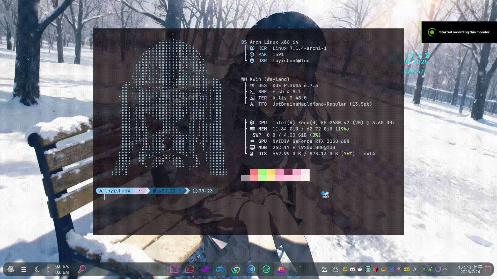

<div align="center">


# UltralightWeb Cursor

[](LICENSE)
[](https://aur.archlinux.org/packages/ultralightwebcursor-git)
[](#)
[](#)
[](https://ultralig.ht/)

**English** | [繁體中文](#繁體中文)

  
  


</div>

---

## English

**UltralightWeb Cursor** is a Linux custom animated cursor framework built on **Wayland** and **Ultralight**.

It lets you design cursor effects with plain **HTML, CSS, and JavaScript**. Whatever you render gets converted into a native Wayland/KWin cursor in real time — fully customizable, fully programmable.

The project is split into three independent pieces so each part stays simple and swappable:

| Component | Role |
|---|---|
| `kwin-plugin` | The actual KWin Effect — renders your HTML theme and draws it as the system cursor, globally, across every window |
| `settings-app` | A small Qt/QML GUI to pick your theme, toggle the effect on/off, and manage settings |


### Features

- Native Wayland/KWin cursor rendering — works across all windows, not just one app
- HTML/CSS/JavaScript-based cursor themes
- Ultralight rendering backend (headless, CPU-rendered — no GPU context conflicts with KWin)
- Real-time cursor updates, including click/drag reactive effects
- Transparent cursor rendering
- Persistent user settings (remembers your last theme/state)
- Graphical settings app (QML) with live "apply without logout" support

### Installation

**Arch Linux (recommended):**

```bash
yay -S ultralightwebcursor-git
```

**Manual build (any distro, until packaging matures):**

```bash
git clone https://github.com/yourname/UltralightWeb-Cursor.git
cd UltralightWeb-Cursor
./build.sh
```

This builds and installs all three components: the KWin plugin, the settings app, and the test daemon.


### Setting

```bash
/.config/ultralightwebcursor/config.ini
```

   (also searchable from KRunner / the app launcher as **"UltralightWebCursor-GUi"**)

3. Changes apply live via **Apply** — no logout required.

### Roadmap (not implemented yet)

These are planned, not yet built — contributions welcome:

- **Cursor Editor** — a graphical editor for authoring cursor animations
- **Animation Timeline** — keyframes, frame interpolation, animation curves
- **Advanced Effects** — particle cursors, glow effects, physics-based animation, shader effects
- **Theme Marketplace** — theme packages, import/export, community sharing

### Author

**LuYishan**

---

## 繁體中文

**UltralightWeb Cursor**是一個基於 **Wayland** 與 **Ultralight** 打造的 Linux 自訂動畫游標框架。

你可以直接用 **HTML、CSS、JavaScript** 設計游標特效，渲染出來的畫面會即時轉換成原生的 Wayland/KWin 游標——完全可自訂、完全可程式化。

專案拆成三個各自獨立的部分，讓每個模組單純、可替換：

| 元件 | 作用 |
|---|---|
| `kwin-plugin` | 真正的 KWin Effect——渲染你的 HTML 主題並畫成系統游標，跨所有視窗全域生效 |
| `settings-app` | 小型 Qt/QML 圖形化設定工具，用來選主題、開關特效、管理設定 |


###  特色

- 原生 Wayland/KWin 游標渲染——跨所有視窗生效，不只單一 App 內
- 基於 HTML/CSS/JavaScript 的游標主題
- Ultralight 渲染後端（headless、CPU 渲染，不會跟 KWin 的 GPU context 打架）
- 即時游標更新，支援點擊/拖曳互動特效
- 透明背景游標渲染
- 使用者設定持久化（記得你上次的主題/開關狀態）
- 圖形化設定工具（QML），支援「不用登出即可套用」

###  安裝

**Arch Linux（推薦）：**

```bash
yay -S ultralightwebcursor-git
```

**手動編譯（其他發行版，套件尚未成熟前的替代方案）：**

```bash
git clone https://github.com/yourname/UltralightWeb-Cursor.git
cd UltralightWeb-Cursor
./build.sh
```

這樣會一次把三個元件（KWin plugin、設定工具、測試 daemon）都編好並安裝。


### 設置

```bash
/.config/ultralightwebcursor/config.ini
```

   （也可以直接在 KRunner / 應用程式選單搜尋 **「UltralightWebCursor-GUi」**）

3. 按下 **套用** 即時生效，不需要登出。

### 開發規劃（尚未實作，但是現在還沒做完 :)）

以下是規劃中、還沒做出來的功能，歡迎貢獻：

- **游標編輯器** — 圖形化製作游標動畫的編輯器
- **GPU渲染兼容** — 優化效能

<sub>純ai readme文本:) ,但我其實還沒發布在AUR上,要用可以用.sh載還有求大佬PR更好看的HTML檔本人網站小白😭</sub>

### 作者

**LuYishan**
